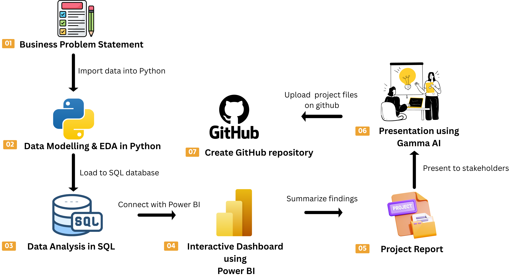
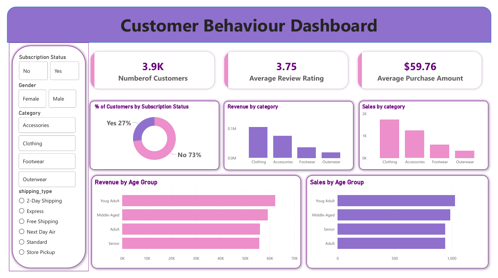

## 📌 Project Overview

The goal of this project is to analyze customer shopping behavior and simulate an end-to-end data analytics workflow, demonstrating how raw transactional data can be transformed into meaningful business insights.

### Project Workflow

✅ **Data Preparation & Cleaning (Python - Pandas)**
- Imported the dataset into Python
- Explored dataset structure and variables
- Handled missing values
- Standardized column names
- Performed data quality checks
- Prepared the dataset for SQL and Power BI analysis

✅ **Business Analysis (SQL)**
- Loaded the cleaned dataset into SQL
- Analyzed customer purchasing behavior
- Evaluated subscription impact on revenue
- Identified top-performing products
- Compared customer segments
- Generated business insights using SQL queries

✅ **Visualization & Insights (Power BI)**
- Built an interactive Power BI dashboard
- Created KPI cards and visual reports
- Analyzed revenue trends
- Explored category performance
- Visualized customer demographics and purchasing patterns

✅ **Report & Presentation**
- Summarized key findings and business recommendations
- Created a project presentation to communicate insights effectively

---

## 🚀 Project Execution Steps

### Dataset
[Customer Shopping Behavior Dataset](customer_shopping_behavior.csv)

### 1. Open the Python Notebook

[Python Analysis Notebook](customer_shopping_behavior.ipynb)

This notebook contains:

- Data Import
- Data Exploration
- Data Cleaning
- Feature Engineering
- Data Preparation for SQL Analysis

### 2. Perform SQL Analysis

[SQL Business Analysis Queries](customer_shopping_behavior.sql)

This file contains SQL queries used to answer business questions such as:

- Revenue by Gender
- Top Rated Products
- Subscription Analysis
- Customer Segmentation
- Revenue by Age Group
- Shipping Type Analysis

### 3. Open the Power BI Dashboard

[Power BI Dashboard File](customer_shopping_behavior.pbix)

The dashboard includes:

- Customer Overview
- Revenue Analysis
- Category Performance
- Subscription Insights
- Age Group Analysis

### 4. Review the Presentation

[Project Presentation PDF](customer_shopping_behavior.pdf)

Contains:

- Project Overview
- Methodology
- Key Findings
- Business Recommendations

---

## 📊 Dashboard Preview

---

## 📈 Business Outcome

This analysis provided valuable insights into customer purchasing behavior, product performance, and subscription trends. The findings can help businesses improve customer engagement, optimize marketing strategies, and support data-driven decision-making.
